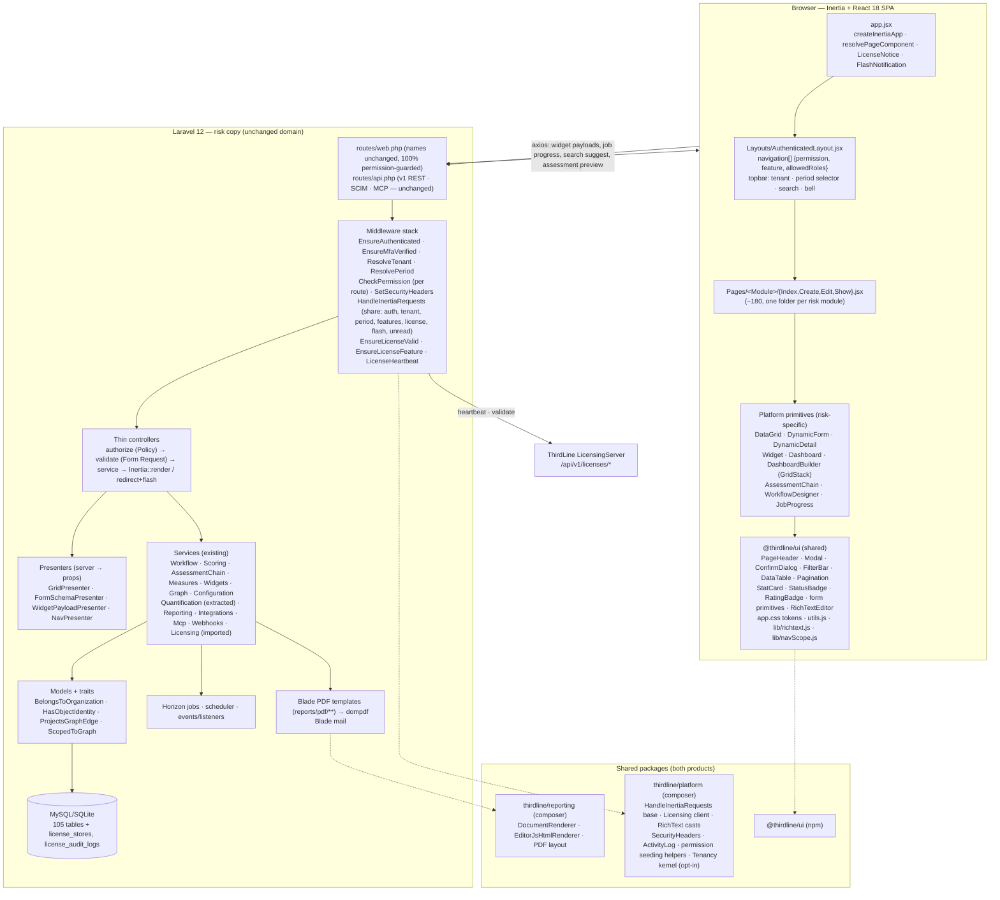
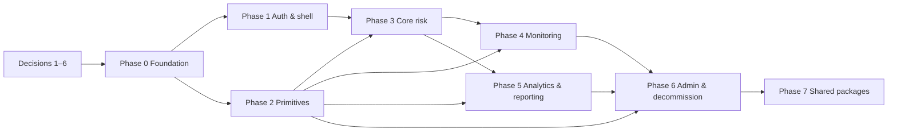

# 04 — Migration strategy: bring the risk product onto the ThirdLine architecture

Status: **proposal, analysis only — no code changed.** Companion documents: `01-reference-architecture.md`, `02-current-state-assessment.md`, `03-gap-analysis.md`, `05-phase-prompts/`.

---

## 1. Recommendation: incremental strangler, presentation-layer first

**Do not rebuild.** Evolve `risk copy/` in place: keep its Laravel 12 backend, schema, services, tenancy, API and test suite; replace Blade/Livewire/Alpine with Inertia + React module by module inside the same application; adopt ThirdLine's conventions (thin controllers, Form Requests, Policies, layout, component library, design tokens, licensing client) as each module is touched; then extract the parts both products share into packages.

Why this and not the alternatives:

| Option | Verdict | Reason |
|---|---|---|
| **A. Full rebuild** (new Laravel app from ThirdLine's scaffold, port features) | Reject | Throws away 105 tables, 100 services, the workflow/measure/widget/graph engines, tenancy, API, SSO/SCIM and ~950 tests — the parts that took Feb–Aug 2026 to build and that ThirdLine *lacks*. The thing being replaced (Blade) is the cheapest layer. |
| **B. Copy risk modules into ThirdLine's repo** (one product) | Reject for now | ThirdLine is single-tenant with `role:`-group routing; the risk product's tenancy and per-route permissions would have to be back-ported first, and ThirdLine already carries thin `RiskRegister/KRI/RiskAppetite/RCSA` modules that would collide. Revisit after §6 shared packages exist (Decision 6). |
| **C. Incremental strangler inside `risk copy/`** | **Recommend** | Inertia and Blade coexist natively: Inertia's root view *is* a Blade template, and a route can return `view()` or `Inertia::render()` independently. Each module flips when its pages, Form Requests and Policy exist and its parity checklist is green. The suite stays green at every commit; the demo can run on the mixed app at any point. |
| D. Hybrid: strangler, but start with a fresh `resources/js` tree and delete Livewire on day one | Reject | Deleting Livewire first would take down the data grid (20 screens), dynamic forms, dashboards and all six builders before their replacements exist. |

Hard constraints that shape the plan:

1. **The ERM architecture bet survives untouched.** Object graph, period-aware measures, context-bound widgets, config bundles (`erm-update/00_ERM_REMODEL_MASTER_PLAN.md`) are backend. This programme changes how they are *rendered*.
2. **The 8 Aug 2026 decision "no new front-end framework" is being reversed** by this request. That is Decision 1 below and must be made explicitly, because it re-opens ~120–160 engineer-days that the demo-readiness plan (Waves 0–4, 39 days) did not budget.
3. Route **names** never change (Ziggy and the tests depend on them). Route **return types** change.
4. `RouteAuthorizationTest`, `TenancyIsolationTest`, `NoFabricatedNumbersTest`, `AdminNavigationTest`, `PreflightRouteGuardTest` stay green after every phase. A phase that needs them loosened is a phase done wrong.

---

## 2. Target architecture

Key structural rules of the target:

- **Server-driven SPA** (ThirdLine §1): the backend owns routing, authorization, validation and data shaping; React renders props. The only client→server calls outside Inertia visits are the axios endpoints listed above, each of which exists today as a `fetch`/Livewire equivalent.
- **Presenters** are the one new backend concept. They turn existing server objects (`GridDefinition`, `FormFieldRegistry` schema, `WidgetDataService` payload, nav config) into JSON props. They are plain classes in `app/Presenters/` (ThirdLine has no such folder; this is a justified addition because ThirdLine has no equivalent server-defined grid/form/widget machinery to present).
- **Feature keys** for licensing map onto risk modules (§4.2).
- **Blade survives only for PDF templates, mail, and the single Inertia root view.**

---

## 3. Data migration plan

There is **no data migration** in the usual sense: the schema is the source of truth for both the old and new presentation layers, and the strangler keeps one database throughout. The plan is therefore about *schema additions* and *validation that nothing drifts*.

### 3.1 Schema mapping old → new

| Area | Old | New | Migration |
|---|---|---|---|
| All 105 domain tables | as-is | as-is | none |
| Licensing | — | `license_stores`, `license_audit_logs` (copied from ThirdLine `2026_03_25_*`) | additive, Phase 0 |
| Rich text | `text`/`longtext` columns hold plain text | same columns hold Editor.js JSON *or* legacy plain text; `RichText` cast passes legacy text through (ThirdLine `App\Casts\RichText`) | none (cast is backward-compatible); optional widen-to-longtext where a description column is `text` |
| Nav / permissions | 118 permissions | 118 + any new page-level permissions (`license.view`, `license.manage`) | additive seeder + grant migration, same pattern as `2026_08_16_120002_grant_dashboard_permissions_to_roles.php` |
| `data_grid_views` | Livewire-shaped state JSON (`filters`, `sort`, `columns`) | same keys, produced by the React grid | none if the React grid emits the same shape; otherwise a one-off `grid-views:migrate` command |
| `dashboards.published_layout`, `dashboard_user_prefs.layout_override` | GridStack serialisation from `widgets/builder.js` | same GridStack serialisation from the React builder | none — keep the serialiser contract (`x,y,w,h,id`) |
| MFA columns on `users` | `mfa_secret`, `mfa_enabled`, … | same; fix the TOTP counter width in code, not schema | none |
| Legacy dual-path tables (`kri_measurements`, `business_units`, `approval_requests`, typed pivots) | read by some screens | **the port must not add readers**; the existing deprecation process (`docs/schema/deprecations.md`, `schema:audit-deprecated`) continues independently | none in this programme |

### 3.2 Migrations and seeders to write

1. `create_license_tables` (copy of ThirdLine's two migrations, namespaced under `App\Models\LicenseStore` / `LicenseAuditLog`).
2. `grant_platform_page_permissions_to_roles` (e.g. `license.view`, `license.manage` → `super-admin`; mirror in `RolesAndPermissionsSeeder`).
3. Factories for the top ~25 models (risk has only `UserFactory`); ThirdLine's tests rely on factories and the new Inertia tests will too.
4. No changes to `DemoDataSeeder` / `WidgetDashboardSeeder` except where a screen's port exposes a seeded value that the old Blade hid.

### 3.3 Data validation steps (run at each module flip and at cutover)

- **Characterisation first**: before extracting logic from a fat controller, pin its outputs with a test in `tests/Feature/Characterisation/` (the folder already holds four) using seeded fixtures; the extraction must reproduce byte-identical JSON.
- **Screen parity**: for each ported page, an `assertInertia()` test asserts the prop set the React page needs *and* a legacy-vs-new comparison of the underlying query (same paginator totals, same ordering) using `tests/Support/CreatesDomainFixtures`.
- **Grid parity**: `GridPresenter` is tested against every definition in `app/Grids/Definitions/` (columns, filters, default sort, permission) — a loop test like `AdminNavigationTest`.
- **Widget parity**: payloads from `WidgetDataService` are already tested (`tests/Feature/Widgets/`); the React renderer is tested by snapshotting the *inputs* it receives, not pixels.
- **Provenance**: `NoFabricatedNumbersTest` must keep passing; any number rendered by React must come from a prop the test can trace.
- **Tenancy**: `TenancyIsolationTest` + a new `InertiaSharedPropsTest` asserting shared props never include another tenant's data and never include the full `User` model.

---

## 4. Phased implementation plan

Effort is engineer-days (one senior Laravel+React developer; see `03 §3`). Every phase ends with: suite green, `app:preflight` green, `npm run build` clean, parity checklist for the phase signed.

### Phase 0 — Foundation (8–10 d) · prompt `05-phase-prompts/phase-0-foundation.md`

Scope: install Inertia 2 + React 18 + Ziggy + `@vitejs/plugin-react` **alongside** Livewire; new `resources/views/app.blade.php` root view; `resources/js/app.jsx`; copy ThirdLine's `resources/css/app.css` tokens (merge risk `--viz-*` tokens, keep `fonts.css`), `Components/*`, `Layouts/*`, `utils.js`, `lib/*`; `HandleInertiaRequests` sharing `auth.{id,name,email,roles,permissions}`, `tenant`, `period`, `features`, `license`, `flash`, `unreadNotifications`; `AuthenticatedLayout` with the risk `navigation[]` (all 22 sections gated on their routes' permissions — closes `02 §6.8`); `SetSecurityHeaders`; import ThirdLine licensing (services, middleware, config, migrations, `Settings/License.jsx`, `LicenseNotice`); a first ported page (`/risk/dashboard` shell or `/my`); Larastan level 5 + baseline; CI adds `npm run build`, PHPStan; deploy `needs: ci`; `.gitignore` the scratch directories.
Dependencies: Decisions 1–4. Deliverables: mixed-mode app boots; one Inertia page renders inside the new layout; Livewire pages still work under the old layout. Acceptance: all existing tests pass; `RouteAuthorizationTest` still 100 %; new `InertiaSharedPropsTest`, `NavigationPermissionGateTest` (every nav item's `permission` equals its route's `permission:` middleware — the `AdminNavigationTest` rule generalised to the whole sidebar).

### Phase 1 — Auth and platform shell (8–10 d) · `phase-1-auth-shell.md`

Scope: `Pages/Auth/{Login,ForgotPassword,ResetPassword,MfaSetup,MfaVerify}`, `Pages/Profile`, SSO entry points (unchanged backend), landing (`/`), `/my`, notifications index, global search page + suggest endpoint, period selector, topbar tenant chip; **fix the three MFA defects** while `AuthController` is refactored into Breeze-shaped controllers (`Auth/AuthenticatedSessionController` etc.) + `LoginRequest`; delete `auth/register.blade.php` hard-coded roles in favour of admin user creation. Keep every rate limiter (`routes/web.php:86-200`).
Acceptance: `AuthenticationRateLimitTest`, `MfaEnforcementTest`, `MfaFeatureGateTest`, `SsoProvisioningTest` green; a new `MfaLoginFlowTest` proves `verifyMfa` logs the user in with an 8-byte counter and no third-party QR host; `assertInertia` for each page.

### Phase 2 — Platform primitives (18–24 d) · `phase-2-primitives.md`

Scope: `app/Presenters/GridPresenter` + React `DataGrid` (server-driven search/sort/filters, saved views, bulk actions, inline edit, CSV/XLSX links) replacing `app/Livewire/DataGrid.php` — flipped grid-by-grid behind the same `GridDefinition`s; `FormSchemaPresenter` + React `DynamicForm`/`DynamicDetail`; `WidgetPayloadPresenter` (thin — payload already exists) + React `Widget` with the 14 Chart.js renderers ported from `resources/js/widgets/charts.js` into `resources/js/widgets/renderers/*.jsx` + `treemap`/`network` DOM renderers; `Pages/Hq/Show`, `Pages/Dashboards/{Index,Edit}` with GridStack in React; `useJobProgress` hook; `RichTextEditor` wired to the first narrative fields.
Acceptance: `GridPresenterCoversEveryDefinitionTest`; `tests/Feature/Grid/*` (12 files) green against the presenter; `tests/Feature/Widgets/*` green; `HqSurfacesTest` green; saved views created by the old grid load in the new one.

### Phase 3 — Core risk modules (24–30 d) · `phase-3-core-risk.md`

Order (each = Form Request + Policy + service extraction where needed + pages + tests): Scoping/entities → Risk register → Risk assessments (**server-side preview endpoint replaces the Alpine mirror**, or JS mirror + `tests/js/mirror-parity.mjs`-style gate — Decision 5b) → Controls + control tests → Treatments → Appetite → Approvals/my-tasks/workflow instance pages → RCSA.
Acceptance: `DemoLoopTest`, `UpgradeEndToEndTest`, `tests/Feature/Assessments`, `Treatments`, `Scoring`, `Workflow/*` green; policies registered and exercised by tests; zero `exists:` string rules in the new Form Requests (tenant-scoped `Rule::exists` only).

### Phase 4 — Monitoring modules (20–26 d) · `phase-4-monitoring.md`

Order: KRI (+ measurements, thresholds, breaches) → Periods & threshold re-baselining → Loss events (+ near misses, RCA, approvals; extract `LossEventService`, move the ₦10 m threshold into `RegulatoryThresholdService`/config, evaluate once) → Issues (+ ageing, closure, escalation; extract `IssueDashboardService`) → Campaigns & questionnaires → Emerging risks.
Acceptance: `tests/Feature/Measures/*` (8), `Issues`, `Notifications/*`, characterisation tests for `LossEventNetLoss` and `RegulatoryThresholdService` green; `treatments:check-overdue` / `issues:check-overdue` unaffected.

### Phase 5 — Analytics, quantification and reporting (22–28 d) · `phase-5-analytics-reporting.md`

Order: Analysis (extract `RiskMovementService`; bands from `ScoringProfile`, not literals) → Quantification (**extract `QuantificationService`, `IcaapService`, `ScenarioLibrary` from the 1,611-line controller first, pinned by `MonteCarloService` characterisation + a new ICAAP characterisation**; then pages) → Regulatory → Reports (screens only; PDF Blade stays) → Exports/Imports/Documents → AI screens (tools + forecast/radar/pulse).
Acceptance: `NoFabricatedNumbersTest` green (this phase touches every figure it guards); `Characterisation/*` green; report generation job + status polling works from React; OpenAPI unchanged.

### Phase 6 — Administration and decommission (16–20 d) · `phase-6-admin-decommission.md`

Order: Users/roles → Org + SSO settings → Object-type / attribute / relationship-type / lifecycle builders → Scoring-profile builder → Workflow designer → Config bundles → Webhooks, API tokens, Connectors, Jobs → **remove Livewire, Alpine, GridStack-in-Blade, `app.js`, 47 inline-script views, `layouts/*`, `components/*`** → delete `livewire/livewire`, `alpinejs` from dependencies; drop the Livewire route override in `AppServiceProvider`.
Acceptance: `AdminNavigationTest` green; `grep -r "livewire\|x-data\|@php" resources/views` returns only `reports/pdf/**` and `emails/**`; `composer show livewire/livewire` fails; bundle size reported.

### Phase 7 — Shared packages and hardening (8–12 d) · `phase-7-shared-packages.md`

Scope: extract `@thirdline/ui`, `thirdline/platform`, `thirdline/reporting` (§6); backfill Policies + Form Requests on any controller not touched in Phases 3–6; PHPStan baseline to zero for `app/Http`; align `.env.example`; write `DEVELOPMENT_STANDARD.md` deltas back to ThirdLine; final parity sign-off (§8).

### Dependency graph

With two developers: A takes P1 → P3 → P5; B takes P2 → P4 → P6 (grid/widget primitives are B's first job because P3/P4 both consume them).

---

## 5. Module-by-module conversion order (single list)

1. Foundation: Inertia entry, layout, tokens, shared props, licensing, CI.
2. Auth pages + MFA fix; profile; landing; `/my`; notifications; search; period selector.
3. `DataGrid` + `GridPresenter` (flip `EntitiesGrid` first as the pilot).
4. `DynamicForm` / `DynamicDetail`.
5. `Widget` + renderers; HQ; dashboards + builder.
6. Scoping / entities. 7. Risk register. 8. Risk assessments (chain). 9. Controls + tests. 10. Treatments. 11. Appetite. 12. Approvals / my-tasks / workflow instances. 13. RCSA.
14. KRI. 15. Periods + thresholds. 16. Loss events + near misses + RCA. 17. Issues. 18. Campaigns + questionnaires. 19. Emerging risks.
20. Analysis. 21. Quantification (service extraction first). 22. Regulatory. 23. Reports. 24. Exports / imports / documents. 25. AI screens.
26. Admin: users → settings/SSO → builders ×4 → scoring profiles → workflow designer → config bundles → integrations → jobs.
27. Decommission Livewire/Alpine/Blade UI.
28. Package extraction, policy backfill, sign-off.

---

## 6. Shared-code strategy

The goal the brief states — "both products share a common, scalable technical foundation" — is met by three packages, extracted in Phase 7 once the risk product has *used* them for six phases (extract what is proven, not what is planned).

| Package | Type | Contents (source of truth today) | Consumers |
|---|---|---|---|
| `@thirdline/ui` | npm (private registry or git dependency) | `Components/*` (41 + risk's `DataGrid`, `DynamicForm`, `Widget`, `DashboardBuilder`), `Layouts/*`, `css/app.css` tokens + component layer, `utils.js`, `lib/richtext.js`, `lib/navScope.js`, `hooks/*`. Source: `internalaudit/resources/js/**` + `risk copy/resources/js/**` after Phase 6 | both |
| `thirdline/platform` | composer (path repo → private Packagist/Satis) | `HandleInertiaRequests` base class with an overridable `share()` envelope; `Licensing/*` + middleware + config + migrations + `LicenseController`; `Casts/RichText*` + `Services/RichText/*`; `SetSecurityHeaders`; `LogRequestActivity` + `LogsActivity`; permission-seeding helper that makes seeder + grant-migration one definition (kills the "keep both in step" hazard in both repos); `RestrictedRoleScope`; **Tenancy kernel** (`TenantContext`, `OrganizationScope`, `BelongsToOrganization`, `ResolveTenant`) as an opt-in service provider so ThirdLine can adopt it when it needs multi-entity; `CheckPermission` (fail-closed) | both (ThirdLine adopts tenancy later) |
| `thirdline/reporting` | composer | `DocumentRenderer` (dompdf + Excel), `EditorJsHtmlRenderer`, shared PDF layout partial, `BoardPackAssembler` contracts, optional Browsershot driver | both |

Candidates deliberately **not** shared yet: `WorkflowEngine` (ThirdLine's approvals are simpler and only findings use them — share after ThirdLine's next approval-workflow feature), `Widgets/*` engine (ThirdLine has no configurable dashboards yet — share when it wants them), `Grids/*` (same), `ApiResourceRegistry` (ThirdLine has no public API).

Mechanics: start with a monorepo-style `packages/` directory inside `risk copy/` using composer `path` repositories and an npm workspace, so extraction is a move not a rewrite; publish to a private registry only when ThirdLine's first consuming PR is ready. Versioning: semver, one CHANGELOG per package, the risk product pins `^0.x` until ThirdLine consumes.

Conventions that the shared packages *fix* for both products (from `01 §11`): fonts self-hosted; single Tailwind major; no full `User` in shared props; permissions defined once; `Audit Supervisor`-style unseeded roles impossible because the seeding helper validates route gates against seeded roles.

---

## 7. Testing, cutover and rollback

**Testing pyramid per module flip**

1. Existing feature tests for the module stay green (they hit routes, not views, so most pass unchanged once the controller returns Inertia).
2. `assertInertia()` prop tests for each page (component name, prop keys, pagination shape, filters echoed).
3. Policy tests (allowed/denied per role; tenant mismatch → 404 via `ScopedToGraph` or 403 via policy).
4. Form Request tests including a cross-tenant `exists` rejection.
5. JS: `npm run build` in CI; a `tests/js/` parity script only where a rule is intentionally duplicated (assessment preview if Decision 5b picks the mirror); no snapshot tests of markup.
6. Guard tests: the five named in §1 plus `NavigationPermissionGateTest`, `GridPresenterCoversEveryDefinitionTest`, `InertiaSharedPropsTest`.

**Cutover** — there is no big-bang. Each module flips on its own commit: routes for that module switch from `view()` to `Inertia::render()`; the old Blade files for the module are deleted in the same commit (not left as fallback — two renderers per screen is how drift starts). The mixed app is deployable at every commit because both layouts serve from the same session, permissions and tenant context. Demo environments can be re-seeded (`db:seed`) at any phase boundary; `dashboards.version` is not re-written on seed (Wave 2 note), so user layouts survive.

**Rollback** — per module: `git revert` the flip commit (Blade files return, routes return). Per phase: revert the phase's merge. Schema additions are additive-only, so a revert never needs a `down()`; the licensing tables can stay empty under a reverted Phase 0. There is no data transformation to undo.

**Parity checklist** (maintained as `docs/migration/parity-checklist.md` from Phase 0; one row per route in `routes/web.php`, seeded from `php artisan route:list --json`): route name · old view · new page · permission · Form Request · Policy · grid definition · widget(s) · exports · tests · owner · flipped-on · signed-off-by. A route may only flip when every cell is filled. The final sign-off in Phase 7 is that list with no empty cells and `grep -rl "return view(" app/Http/Controllers` returning only PDF/mail renderers.

---

## 8. Risks, assumptions, open questions

### Risks

| Risk | Likelihood | Impact | Mitigation |
|---|---|---|---|
| Programme collides with the demo/pilot timeline (Waves 0–4 assumed Blade) | High | High | Decision 1; if the demo is imminent, run Wave 4C on Blade first, then start Phase 0 — or start Phase 0/2 in parallel because they do not touch existing screens |
| Fat-controller extraction changes a number (ICAAP, loss net, movement bands) | Med | High (credibility; `NoFabricatedNumbersTest`) | Characterisation tests *before* extraction; byte-identical JSON gate |
| React grid loses a `DataGrid` feature (saved views, inline edit, bulk) | Med | Med | Pilot on `EntitiesGrid`; feature checklist from `app/Livewire/DataGrid.php` public API (25 methods) |
| Chart.js in React re-introduces the sizing bugs Wave 2 fixed | Low | Med | Charts own their container; no `wrapSizedCanvases`; test on wire-navigate-free lifecycle |
| Tailwind v3↔v4 mismatch breaks ThirdLine's `@apply` component layer | Med | Low | Decision 3; a one-day spike in Phase 0 |
| Two developers diverge on component patterns | Med | Med | `@thirdline/ui` is the only place new primitives may be added; PR template asks "which existing component did you reuse?" |
| Licensing import gates the risk product before a licence server org exists for it | Low | Med | `LICENSE_ENFORCE_VALID=false` default; provision the client via `license-server:provision-client` in Phase 0 |
| SQLite test DB hides MySQL-only behaviour (ThirdLine tests are MySQL-only) | Med | Low | Add a MySQL CI matrix job in Phase 0; keep SQLite for speed |
| Legacy dual-path tables get new readers during the port | Med | Med | `schema:audit-deprecated` runs in CI from Phase 0 |

### Assumptions

- Only the risk product is being migrated; ThirdLine's codebase changes in this programme are limited to consuming the shared packages (Phase 7) — nothing earlier.
- One database per deployment continues (single VPS per client, as ThirdLine deploys today); no SaaS multi-DB tenancy is introduced.
- The Aug 2026 Waves 0–3 code is the baseline (`5fe424a`); Wave 4 work, if any, lands on Blade before Phase 3 or on React after it — not both.
- Editor.js is wanted for narrative fields (risk description, rationale, treatment plan narrative, ICAAP commentary). If not, item 25 in `03` drops to zero.
- The mobile/offline PWA remains a later work package and is inherited from `@thirdline/ui` when it arrives.

### Open questions for you (the decisions the summary asks for)

1. **Reverse the "no new front-end framework" decision of 8 Aug 2026?** Yes/no, and where this sits relative to Wave 4 and the pilot pipeline. Everything else is conditional on this.
2. **Team shape and calendar**: one developer (6–8 months) or two (3.5–4.5 months)? Is there a hard date (a pilot, the 1 Jan 2027 residency deadline) the plan must fit?
3. **Tailwind major**: standardise the shared UI on **v4** (risk's current, `@tailwindcss/vite`, no PostCSS config — recommended, ThirdLine already has the plugin installed) or on **v3** (ThirdLine's active pipeline, zero change for ThirdLine)? Affects `app.css` syntax (`@import "tailwindcss"` + `@utility` vs `@tailwind` + `@layer`).
4. **Permission naming**: keep risk's `resource.verb` (recommended — 118 names, 339 routes, 63 `@can`s and a regression test depend on them; ThirdLine already has dotted families) or rename to `"verb resource"` to match ThirdLine's majority style?
5. **Charts and the assessment preview**: (a) allow Chart.js as a justified deviation from ThirdLine's "no chart library" rule (recommended — 21 widget types, LEC/tornado/gauge don't exist in ThirdLine's four SVG charts) or port to hand-rolled SVG? (b) assessment chain preview via a server endpoint (recommended — one source of truth) or a JS mirror with a parity gate?
6. **Product topology**: stay two repositories sharing packages (recommended for this programme), or converge into one "ThirdLine GRC" application after Phase 7 (which would require back-porting tenancy and per-route permissions into ThirdLine and retiring its thin risk modules)?

Secondary questions that can wait until Phase 0: private package registry choice (Satis vs GitHub Packages vs git deps); whether ThirdLine's `LogsActivity` viewer should sit over `domain_events` in the risk product; whether to add Browsershot (needs Chrome on the VPS) or stay dompdf-only; which narrative fields get Editor.js.
